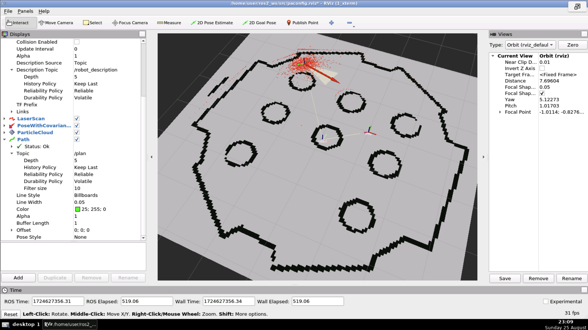
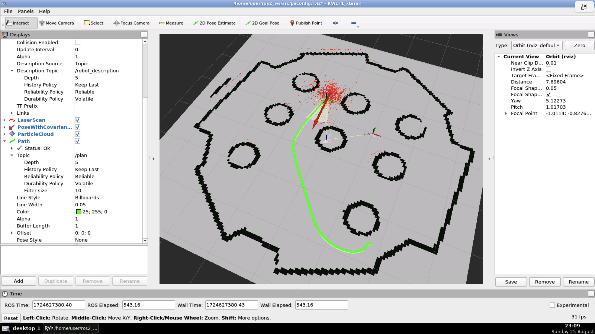
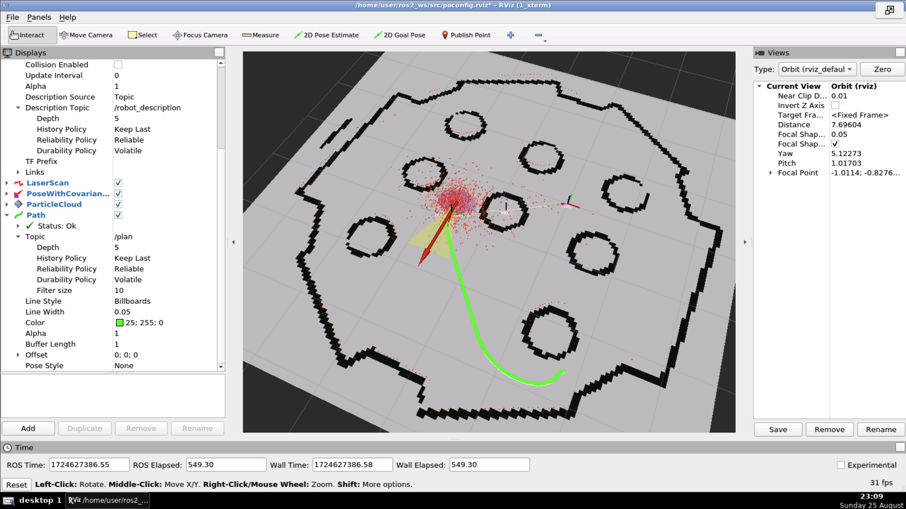
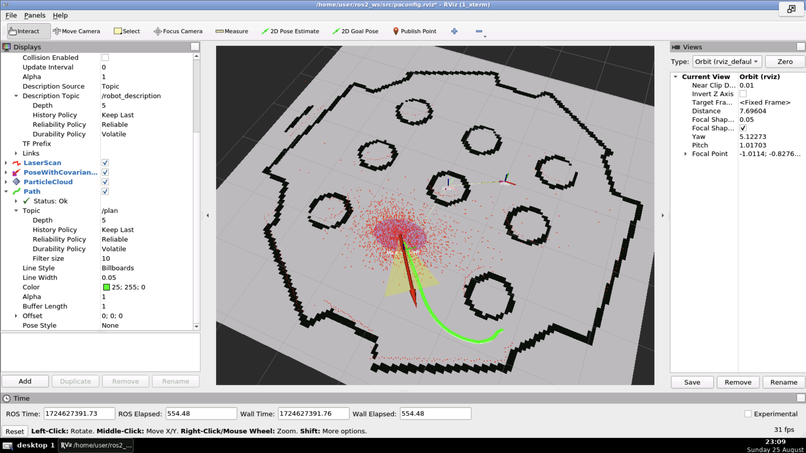
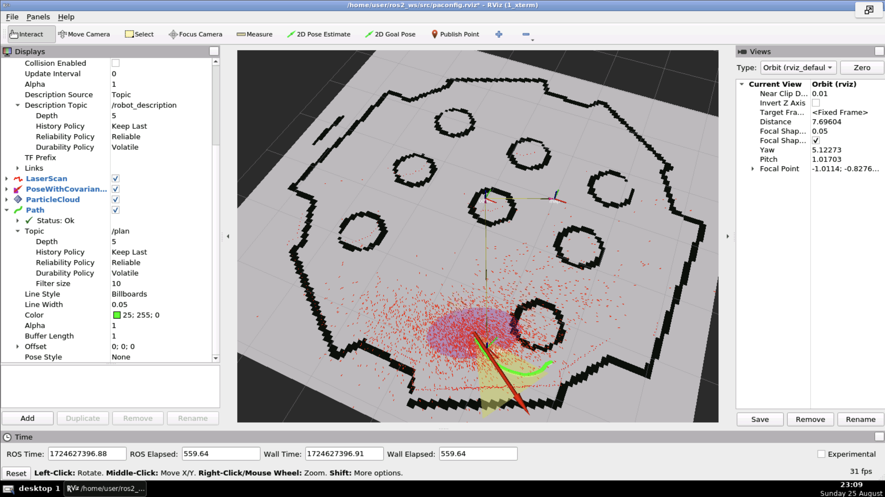
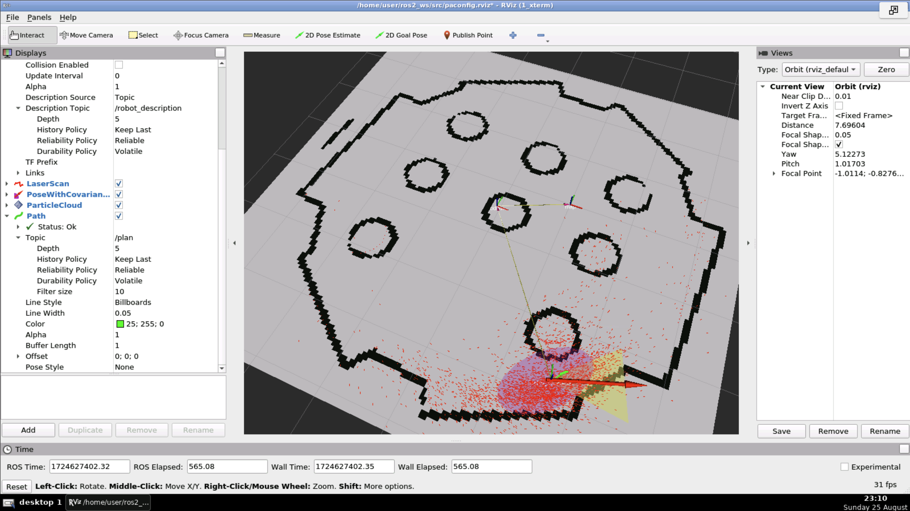
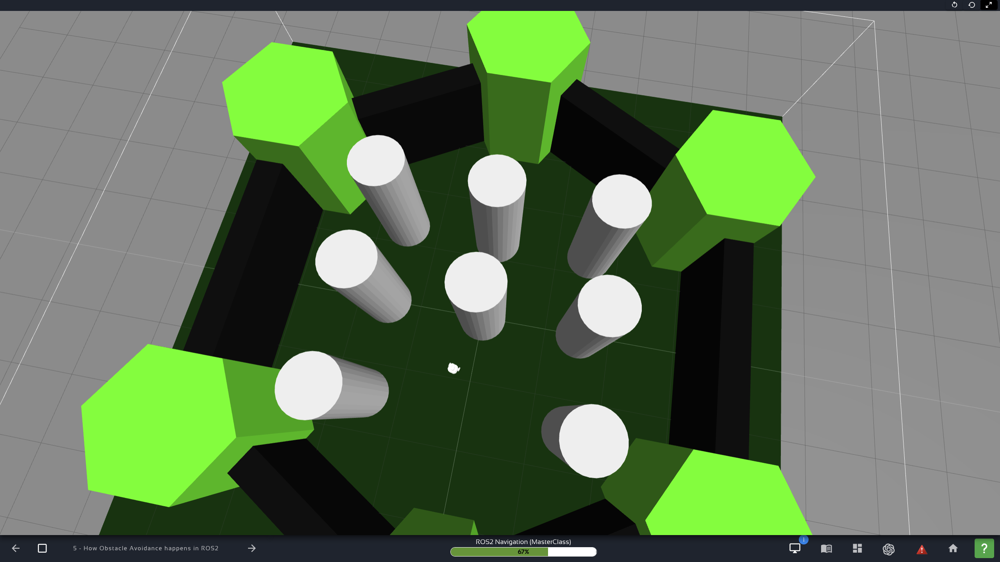
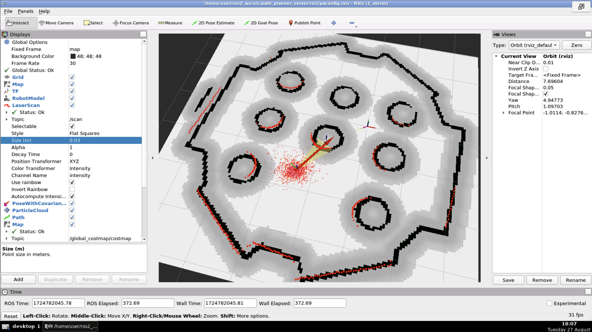
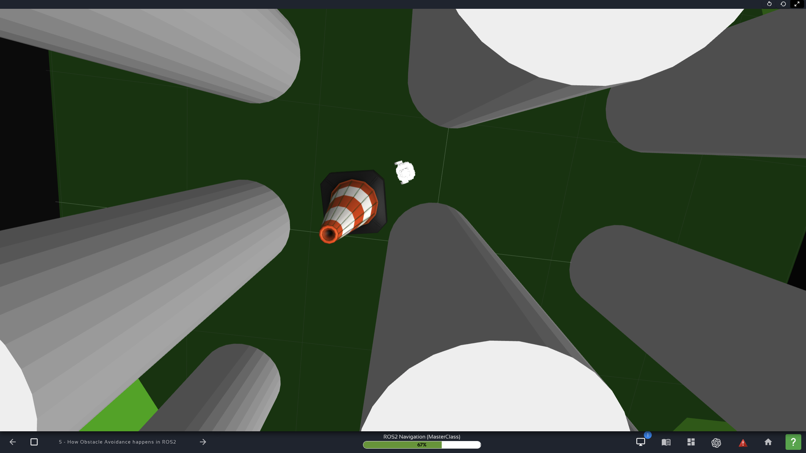
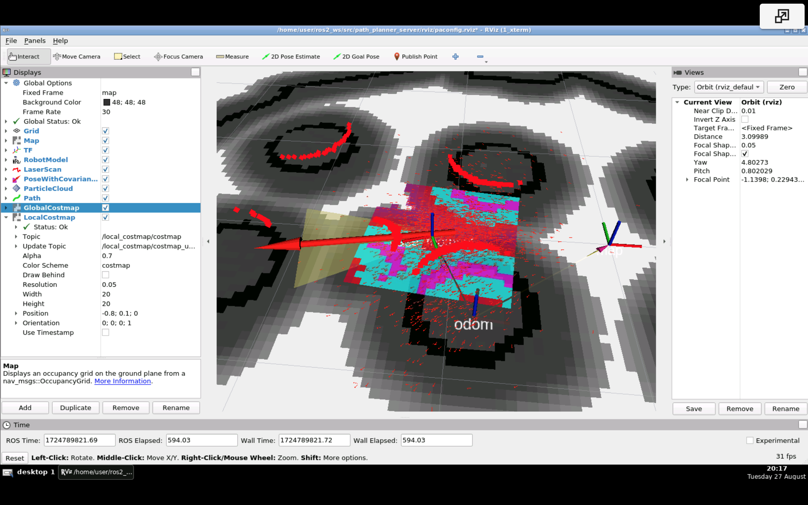

### `path_planner_server`

#### Notes

1. In `DWBLocalPlanner`, "DWB" means **D**ynamic **W**indow **A**pproach. Here is the _abstract_ of the [original paper](https://www.ri.cmu.edu/pub_files/pub1/fox_dieter_1997_1/fox_dieter_1997_1.pdf):
> This paper describes the dynamic window approach to reactive collision avoidance
> for mobile robots equipped with synchro-drives. The approach is derived directly
> from the motion dynamics of the robot and is therefore particularly well-suited for
> robots operating at high speed. It differs from previous approaches in that the search
> for commands controlling the translational and rotational velocity of the robot is
> carried out directly in the space of velocities. The advantage of our approach is that
> it correctly and in an elegant way incorporates the dynamics of the robot. This is done
> by reducing the search space to the _dynamic window_, which consists of the velocities
> reachable within a short time interval. Within the dynamic window the approach only
> considers admissible velocities yielding a trajectory on which the robot is able to stop
> safely. Among these velocities the combination of translational and rotational velocity
> is chosen by maximizing an objective function. The objective function includes a
> measure of progress towards a goal location, the forward velocity of the robot, and
> the distance to the next obstacle on the trajectory. In extensive experiments the
> approach presented here has been found to safely control our mobile robot RHINO
> with speeds of up to 95 cm/sec, in populated and dynamic environments.
2. The reason `DWBLocalPlanner` is called that instead of `DWA...` are not clear and appear to have a historical component.
3. In `bt_navigator`, "bt" stands for **b**ehavior **t**ree.

#### Launching

1. `ros2 launch localization_server localization.launch.py`.
2. `ros2 launch path_planner_server pathplanner.launch.py`.
3. In Rviz2, pick **2D Pose Estimate**. Optionally, move around until localziation converges.
4. In Rviz2, pick **2D Goal Pose**.

#### Path to goal

| Path |
| --- |
|  |
|  |
|  |
|  |
|  |
|  |
|  |

#### Specifying goal

1. Rviz2 (see above).
2. Action:
   ```
   user:~/ros2_ws/src/path_planner_server$ ros2 action list
   /backup
   /compute_path_through_poses
   /compute_path_to_pose
   /follow_path
   /navigate_through_poses
   /navigate_to_pose
   /spin
   /wait
   user:~/ros2_ws/src/path_planner_server$ ros2 action info /navigate_to_pose
   Action: /navigate_to_pose
   Action clients: 1
       /bt_navigator
   Action servers: 1
       /bt_navigator
   ```
   and sending a goal  
   ```
   ros2 action send_goal /navigate_to_pose nav2_msgs/action/NavigateToPose "pose: {header: {frame_id: map}, pose: {position: {x: 1.52, y: 1.92, z: 0.0}, orientation:{x: 0.0, y: 0.0, z: 0, w: 1.0000000}}}"
   ```
3. Topic:
   ```
   user:~/ros2_ws/src/path_planner_server$ ros2 topic info /goal_pose -v
   Type: geometry_msgs/msg/PoseStamped
   
   Publisher count: 1
   
   Node name: rviz
   Node namespace: /
   Topic type: geometry_msgs/msg/PoseStamped
   Endpoint type: PUBLISHER
   GID: a0.88.10.01.ea.4d.3c.6a.2b.93.6b.a2.00.00.28.03.00.00.00.00.00.00.00.00
   QoS profile:
     Reliability: RELIABLE
     Durability: VOLATILE
     Lifespan: 9223372036854775807 nanoseconds
     Deadline: 9223372036854775807 nanoseconds
     Liveliness: AUTOMATIC
     Liveliness lease duration: 9223372036854775807 nanoseconds
   
   Subscription count: 1
   
   Node name: bt_navigator
   Node namespace: /
   Topic type: geometry_msgs/msg/PoseStamped
   Endpoint type: SUBSCRIPTION
   GID: 3c.66.10.01.20.4c.29.ec.f4.0f.7e.c8.00.00.43.04.00.00.00.00.00.00.00.00
   QoS profile:
     Reliability: RELIABLE
     Durability: VOLATILE
     Lifespan: 9223372036854775807 nanoseconds
     Deadline: 9223372036854775807 nanoseconds
     Liveliness: AUTOMATIC
     Liveliness lease duration: 9223372036854775807 nanoseconds
   ```
   and publishing  
   ```
   ros2 topic pub -1 /goal_pose geometry_msgs/PoseStamped "{header: {stamp: {sec: 0}, frame_id: 'map'}, pose: {position: {x: 2.2, y: 0.0, z: 0.0}, orientation: {w: 1.0}}}"
   ```
4. Programmatically with a [Python class](path_planner_server/nav_to_pose_action_client.py).

#### Action `NavigateToPose`

```
user:~/ros2_ws/src/path_planner_server$ ros2 interface show nav2_msgs/action/NavigateToPose
#goal definition
geometry_msgs/PoseStamped pose
        std_msgs/Header header
                builtin_interfaces/Time stamp
                        int32 sec
                        uint32 nanosec
                string frame_id
        Pose pose
                Point position
                        float64 x
                        float64 y
                        float64 z
                Quaternion orientation
                        float64 x 0
                        float64 y 0
                        float64 z 0
                        float64 w 1
string behavior_tree
---
#result definition
std_msgs/Empty result
---
geometry_msgs/PoseStamped current_pose
        std_msgs/Header header
                builtin_interfaces/Time stamp
                        int32 sec
                        uint32 nanosec
                string frame_id
        Pose pose
                Point position
                        float64 x
                        float64 y
                        float64 z
                Quaternion orientation
                        float64 x 0
                        float64 y 0
                        float64 z 0
                        float64 w 1
builtin_interfaces/Duration navigation_time
        int32 sec
        uint32 nanosec
builtin_interfaces/Duration estimated_time_remaining
        int32 sec
        uint32 nanosec
int16 number_of_recoveries
float32 distance_remaining
```

#### Adding costmap

1. Types:
   1. Global
   2. Local

2. ROS2 topics:
   ```
   user:~$ ros2 topic list | grep costmap
   /global_costmap/costmap
   /global_costmap/costmap_raw
   /global_costmap/costmap_updates
   /global_costmap/footprint
   /global_costmap/global_costmap/transition_event
   /global_costmap/published_footprint
   /local_costmap/costmap
   /local_costmap/costmap_raw
   /local_costmap/costmap_updates
   /local_costmap/footprint
   /local_costmap/local_costmap/transition_event
   /local_costmap/published_footprint
   ```

3. Visualization (global):
   | Environment | Global costmap |
   | --- | --- |
   |  |  |  

4. Visualization (local):
   | Obstacles | Local costmap |
   | --- | --- |
   |  |  |  
